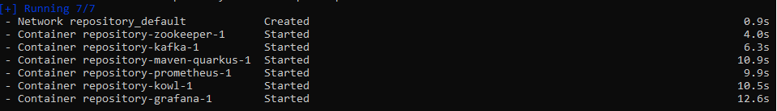

# Kafka_Quarkus_simple
This is a very simple docker environment focused on first steps on kafka.

The docker file will deploy on your host machine all necessary assets to start with kafka and it features. Those assets are:

|Name                                      |Vendor       |Target                                  |
|------------------------------------------|-------------|----------------------------------------|
|[Zookeeper](https://zookeeper.apache.org) |Confluent    |Distributed coordination service        |
|[kafka](https://kafka.apache.org)         |Confluent    |Distributed event streaming platform    |
|[Kowl](https://cloudhut.dev)              |Cloudhut     |Apache Kafka Client Web UI              |
|[Prometheus](https://prometheus.io)       |Prometheus   |Monitoring system                       |
|[Grafana](https://grafana.com)            |Grafana Labs |Operational dashboard for monitoring    |
|[Maven](https://grafana.com)              |Apache       |Project build based for Quarkus project |

In addition an extra maven distribution image with a very simple project (`kafka-simple`) based on [Quarkus-JVM](https://quarkus.io) with a producer & consumer services for a dummy iteration of messages.

# Pre-requisites
You must have installed [Docker](https://docs.docker.com/) in your host. Please check [here for installation instructions](https://docs.docker.com/get-docker)

A recommendation for Docker is to have a client like [Docker Desktop](https://www.docker.com/products/docker-desktop) or [Portainer](https://www.portainer.io) installed.

# Deploy environment
Once you have all git content in your host, execute the following commands (Docker based) where you placed *docker-compose.yaml* file in a terminal window:

`docker-compose -f "docker-compose.yaml" up -d`

> It is not necessary to set -f parameter but to ensure the file is executed.

> Be patient, images content must be downloaded properly. This can take a while.

Chek the output of the command. All container has been deployed properly (all of them `Running` and `Started`):

You can check all deployements using the following command (check the status is *Up*):

`docker ps`

Ok, all software has been deployed succcesfully, now lets play....

# Accessing portals
These are the available web portals for all software images deployed:

|Application      |Endpoint                           |Comments                                  |
|-----------------|-----------------------------------|------------------------------------------|
|Kowl             |http://localhost:4040              |No login is necessary                     |
|Prometheus       |http://localhost:9090/targets      |Check *state* is `UP`                     |
|Grafana          |http://localhost:3000/             |User & password is "admin" for first time |
|Simple Project   |http://localhost:8888/q/swagger-ui |Play with API Rest endpoint               |

# Tips
- You can find a complete Grafana dashboard into the content. Go to folder `resources/grafana/dashboard-template` and check for file `kafka-metrics.json` to import.
- In Grafana, configure a new Data source for Prometheus. Set the following into `URL` field: `http://host.docker.internal:9090`.
- Play with `kowl` client to check kafka topic `events` with message produced.
- Check with `Grafana` dashboard different panels about Kafka, Zookeeper and JVM behaviour

# How to play
Open in a web browser the swagger url related to `kafka-simple` project:

`http://localhost:8888/q/swagger-ui/`

You can check that there is an endpoint `/kakfa-simple/produce/{iterations}` to set a number of iterations to produce random messages. Random message are generated with a random string on key and value. Try it using `Try it out` button. 

You can also execute the request with the following command:

`curl -X 'GET' \
  'http://localhost:8888/kafka-simple/produce/1000' \
  -H 'accept: */*'`

> You have to inform about the number of message to be produced. In the previous sentence `1000` is the number of iterations (message to be produced)

# Shutting down
Execute the following command in a terminal window to shutdown docker containers:

`docker-compose -f "docker-compose.yaml" down`

When a docker container is created, several volumes for persisting data are created. To remove them execute the following command from a terminal window:

`docker volume prune`

Networking containers in docker drivers is focused on connection through network drivers. To remove them execute in a terminal window the following command:

`docker network prune`

Images are the containers defined in your docker-compose file. In a terminal window, execute the following to remove them:

`docker image prune`

If you want to prune all information from docker (images, container, network), you can execute the following command in a terminal window:

`docker system prune --all`